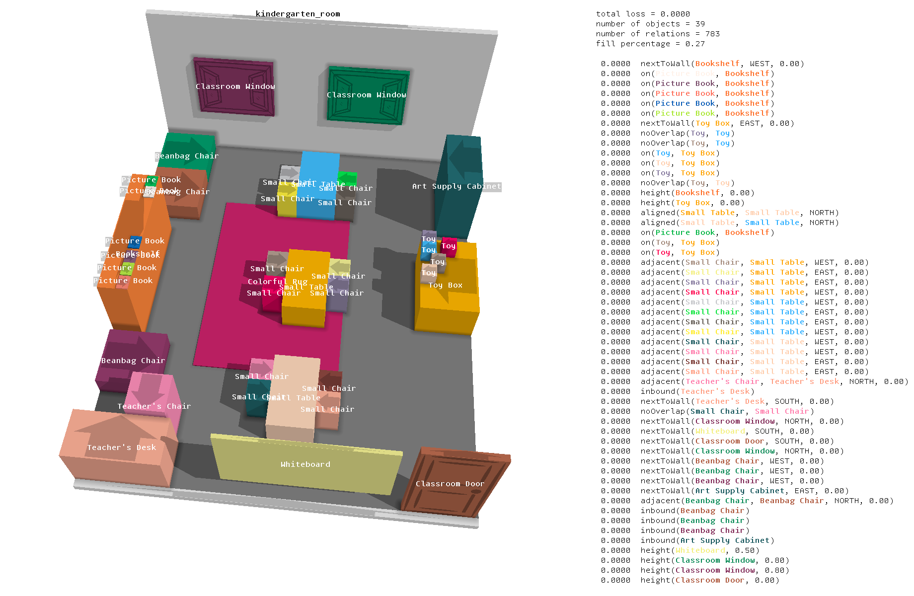

# SceneVisualizer
This scene visualizer is designed to work with [ImperativeScene](https://github.com/mxgmn/ImperativeScene) and [DeclarativeScene](https://github.com/mxgmn/DeclarativeScene).

<p align="center"></p>


## How to build
Get [.NET](https://dotnet.microsoft.com/download) for Windows, Linux or macOS and run
```
dotnet publish --configuration Release SceneVisualizer.csproj
```

A self-contained app will appear in the `bin/publish` folder.

Alternatively, download the latest release for Windows.


## How to run
If you run the visualizer without command line arguments, it will render examples from `scenes.xml` and save the renders in the `output` folder.

This command will render all JSON files in the `examples/` folder that start with `FactoryFlo`:
```
SceneVisualizer.exe folder=examples/ filename=FactoryFlo panelwidth=500 ao=100
```
The renderer will generate 100 rays to calculate ambient occlusion.

You can call SceneVisualizer from Python like this:
```
os.system(f'SceneVisualizer.exe folder=../{OUTPUT_FOLDER}/ filename={basename}- size=1200x1200 panelwidth=600 ao=-1 font=10x20 distance=12 unique=false')
```
